# FastCode
O FastCode foi criado com o objetivo de facilitar as vendas em lojas físicas através do QR-Code. Para o cliente, o app fornece uma maneira de verificar sua compra antes do pagamento, além de um histórico de compras. Para o funcionário, é possível cadastrar os itens a serem vendidos, criar pedidos e verificar o histórico de vendas.
Aprenda como baixar e utilizar o app nesse tutorial!

## Como começar 🔧
O FastCode é um aplicativo android, por isso é necessário um celular android para baixar o app.

# [Baixar FastCode]((https://github.com/Ext-FastCode/FastCode/releases/download/v1.0.0/FastCode.apk))

Ao clicar em "Baixar FastCode" em seu aparelho android, o navegador será aberto. Clique em "Fazer o donwload", espere o download terminar, clique em "abrir" e depois, "instalar". Após a instalação terminar, é só clicar em "abrir" e começar a usar o app!

# Como usar
O aplicativo é dividido em duas partes, "Clientes" e "Funcionários".

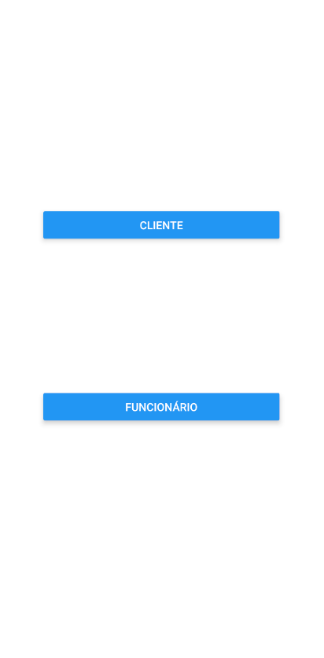

## Clientes 👥
Duas funções estão disponíveis para os clientes: Ler QR-Code e verificar o histórico.

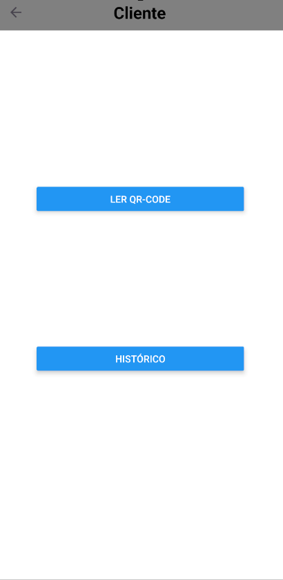

Quando o cliente for pagar seu pedido, ele deve clicar em "Ler QR-Code" e apontar para o QR-Code gerado pelo funcionário, e as informações de seu pedido irão aparecer.

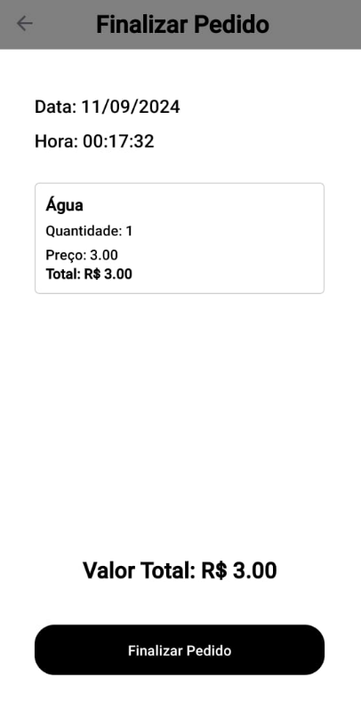

O cliente também pode verificar seu histórico de compras clicando em "Histórico". O histórico guarda a data do pedido e todos os itens comprados.

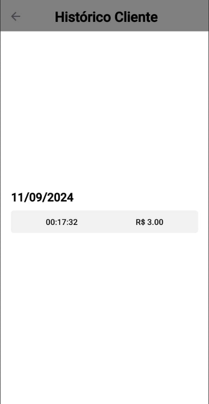
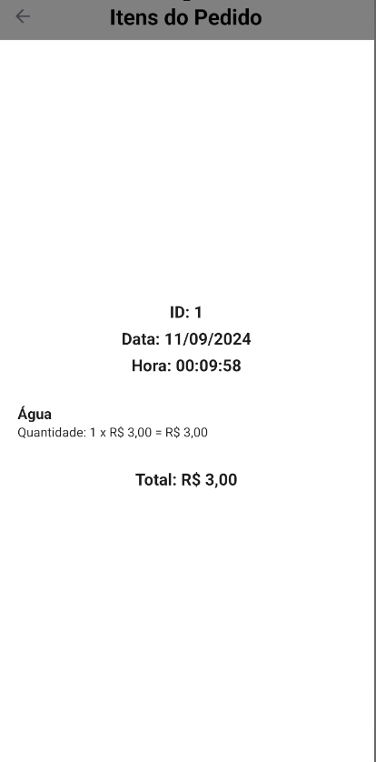

## Funcionários 🧑‍💼
O funcionário tem três funções principais: cuidar dos pedidos, cuidar dos itens e um histórico de vendas.

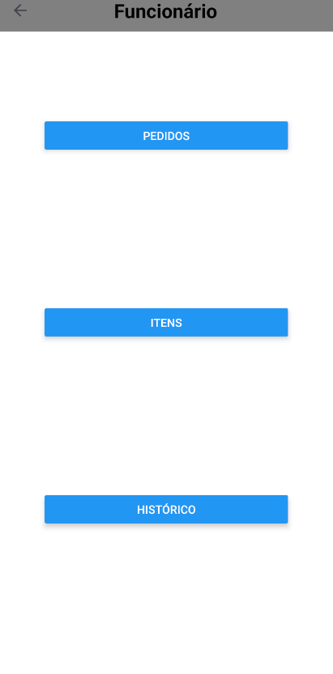

Ao clicar em "Pedidos", o funcionário poderá ver todos os pedidos que ele mesmo criou. Ele pode criar um novo pedido, ou clicar em um pedido existente para abri-lo.

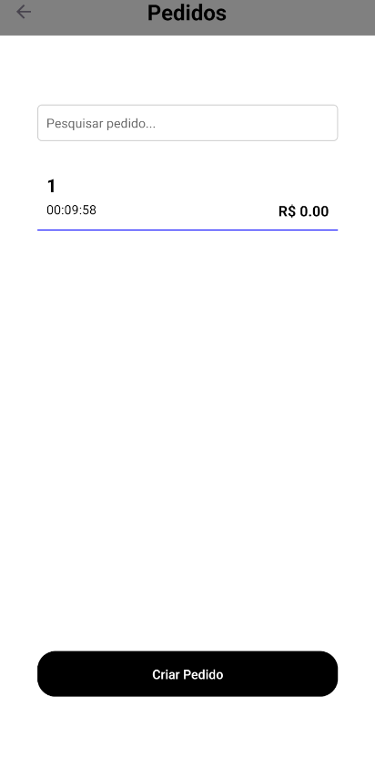

Ao clicar em um pedido, será mostrado todos os itens daquele pedido, entre outras informações. É possível adicionar itens ao pedido clicando em "Adicionar item", excluir um item do pedido clicando no item, cancelar o pedido, e gerar o QR-Code daquele pedido.

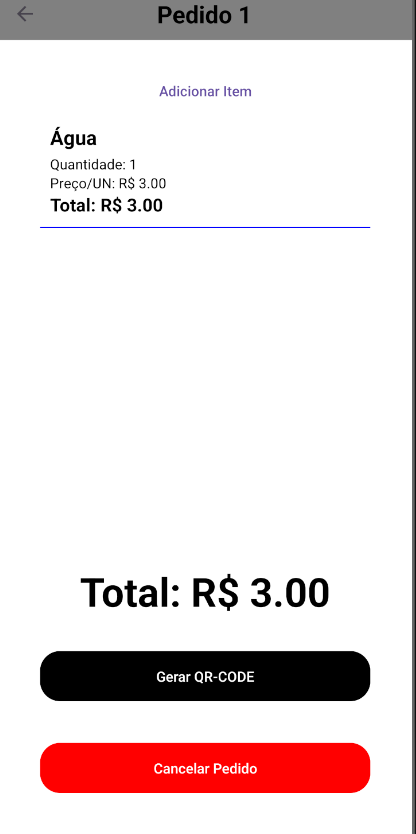

O cliente deverá ler o QR-Code para ver as informações do pedido em seu próprio aparelho.

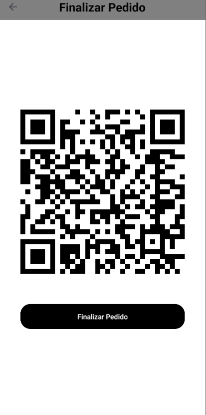

O funcionário também pode ver os itens vendidos pela loja clicando em "Itens" na tela inicial do funcionário. Aparecerão todos os itens cadastrados, sendo que somente itens cadastrados podem ser adicionados em um pedido.

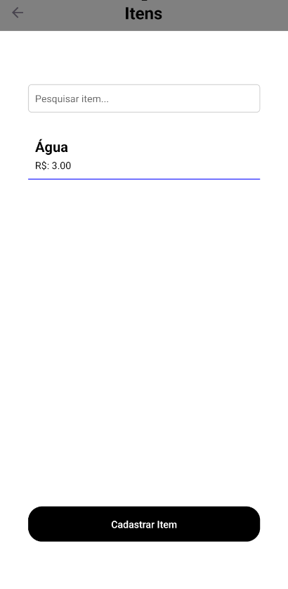

Ao clicar em "Cadastrar Item", é possível cadastrar um novo item.

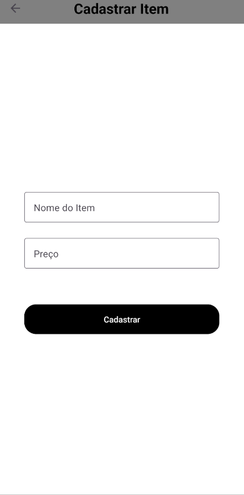

Também é possível alterar ou remover um item clicando em cima dele na tela "Itens".

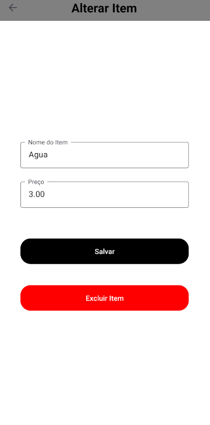

Por fim, o funcionário também possui um histórico de vendas, mostrando o ID, a data, e os itens do pedido, entre outras informações.

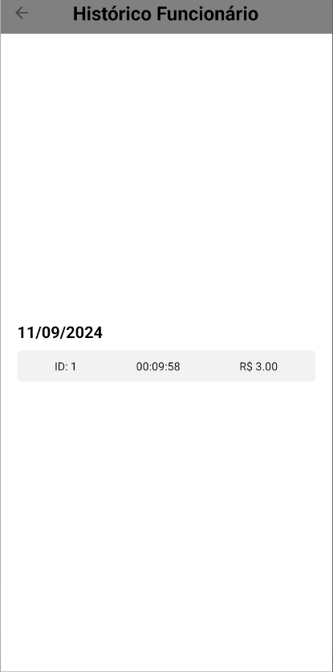

